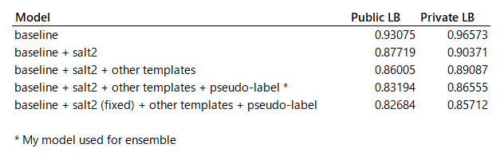
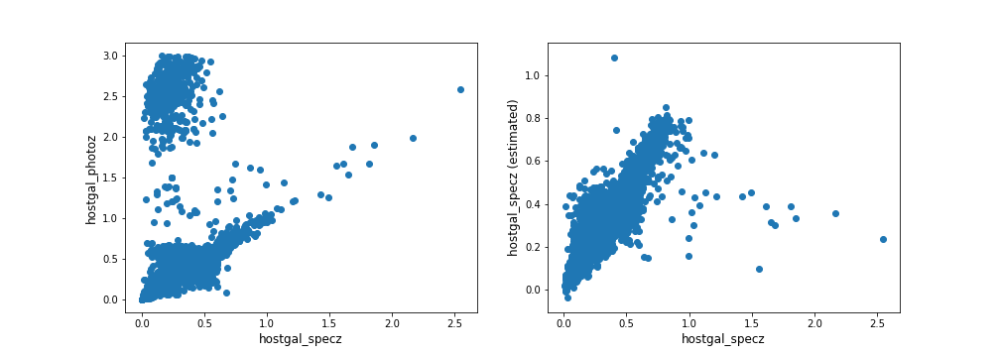
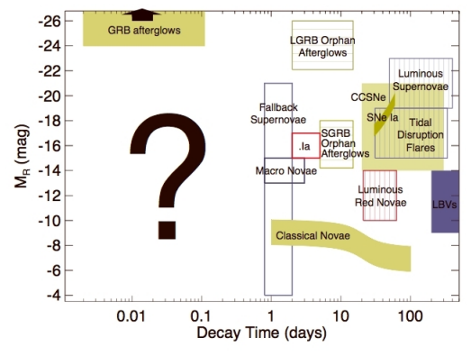

## A1. General

- Competition Name: PLAsTiCC Astronomical Classification
- Team Name: Major Tom
- Private Leaderboard Score: 0.70016
- Private Leaderboard Place: 3rd
- Name: Taiga Nomi (nyanp)
- Location: Osaka, Japan
- Email: Noumi.Taiga  (gmail)

## A2. Background on me and the team

### What is your academic/professional background?

I work as a R&D engineer in factory automation industry for 8 years.
As an OSS developer, I created and maintained a small deep learning library,
 [tiny-dnn](https://github.com/tiny-dnn/tiny-dnn) for 6 years.

### Did you have any prior experience that helped you succeed in this competition?

I majored aerospace engineering and joined a project of developing astrometry satellite.
It may helped me reading articles / papers regarding photometric classification and LSST project.

### What made you decide to enter this competition?

I wanted to learn how to handle time-series data through this competition.

### How much time did you spend on the competition?

About 100 hours in total. 60% spent for feature engineering, 15% for survey, 25% for others.

### If part of a team, how did you decide to team up?

Mamas sent me a message through Twitter. After a short conversation in DM, we agreed with team up.

### If you competed as part of a team, who did what?
We all had different models with different approaches:

- mamas: CatBoost with a lot of hand-crafted features
- yuval: 1D CNN with on-the-fly augmentation
- me: LightGBM with sncosmo features and pseudo-label

## A3. Summary

I splitted data into galactic/extragalactic and trained 2 LightGBM models on them with ~200 features (with silightly different feature sets).
I performed light curve fittng using sncosmo with various source types (salt-2, nugent, snana…),
and use these parameters as a feature of my extragalactic model. These features gave me significant boost on my score.

To handle a difference between train and test set, pseudo-labelling on class90 is used for extragalactic model.

## A4. Features Selection / Engineering
### Light curve fitting features
`sncosmo.lc_fit` is used to fitting light curve with various sources of models. Below are the list of sources I used:

- salt2
- salt2-extended
- nugent-sn2n
- nugent-sn1bc
- snana-2004fe
- snana-2007Y
- hsiao

sncosmo supports [a lot of sources](https://sncosmo.readthedocs.io/en/v1.6.x/source-list.html), but adding more templates
 didn't improve my local CV.

I used sncosmo's built-in [lsst bandpass](https://sncosmo.readthedocs.io/en/v1.6.x/bandpass-list.html#lsst) to fit parameters.
I tried normalized version of bandpass (because the effect of bandpass must be removed from given dataset), but it didn't work well.

Light curve features played a critical role in my model. 
Without any of these features, my private LB score degragates from 0.86555 to 0.96573!

In the last 2 days of the competition, I noticed that my code in salt2 estimation contains bug. 
I didn't have the chance to add fixed version to my model, but it would improved LB score a bit (see below).



### Estimated redshift
To utilize the information from `hostgal_specz`, I trained a LightGBM regressor which predicts `hostgal_specz` 
and added its oof prediction as a feature.

Below shows a difference of redshift features (10000 randomly sampled from dataset where hostgal_specz is not null).
We can see that estimated redshift (right) is far better than `hostgal_photoz` with the criterion of correlation with `hostgal_specz`.



### Luminosity
It is well known that luminosity distance is an important measure for estimating the type of variable objects.
Luminosity itself is also important intrinsic property of stars. Luminosity is not given in the PLAsTiCC dataset, 
but we can get its approximate value by calculating:

```
luminosity ~ (max(flux) - min(flux)) * luminosity_distance ** 2
```

We can get luminosity distance from redshift `z` (estimated above) by calling `astropy.luminosity_distance(z)`,

### Timescales of the detected signal
Timescales of variable event is also well known measurements.



*Figure 8.6 in LSST Science Book. Decay time and magnitude (can be converted from luminosity) seems good feature to classify cataclysmic variable stars.*

So I added bunch of features related to timescales to capture time-series information in LightGBM.

- (max(mjd) - min(mjd)) where detected == 1 
- (max(mjd) - min(mjd)) where flux/flux_err > 3 
- N% decay time after the peak of flux
- rising time from first detected to max flux
- lifetime from max flux to last detected

### Importance plot

Below are the variable importance plot of my models.

- TBD: importance plot, short explanation of features

You can see that light curve fitting features is important in my model.
While previous research shows salt-2 parameters are effective for supernova classification,
my experiment shows that mixing various type of sources gives us additional improvement in the PLAsTiCC dataset.

The number of features I tried are about 700 in total. For each small group of features, 
local CV on training set were measured. 
I added all features within the group to a model only if they improved both local CV and LB.

I also checked feature importance (measured in gain) in each fold, 
and removed individual feature if the number of folds which its feature importance is zero were 9 or 10 (out of 10).

`ra`, `decl`, `gal_l`, `gal_b`, `hostgal_photoz` and `hostgal_specz` were removed from both galactic and extragalactic model.
`distmod` was also removed from galactic model.

### Did you make any important feature transformations?

### Did you find any interesting interactions between features?

### Did you use external data? (if permitted)
I indirectly used existing template model and LSST's passband model through sncosmo's API.

## A5. Training Method(s)

- 10-Fold CV
- Pseudo-Label

## A6. Execution Time

- How long does it take to train your model?
- How long does it take to generate predictions using your model?
- How long does it take to train the simplified model (referenced in section A6)?
- How long does it take to generate predictions from the simplified model?

## A7. Results of the model

## A8. References
