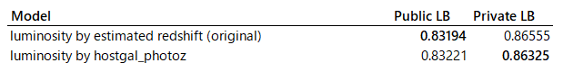

## A1. General

- Competition Name: PLAsTiCC Astronomical Classification
- Team Name: Major Tom
- Private Leaderboard Score: 0.70016
- Private Leaderboard Place: 3rd
- Name: Taiga Noumi (nyanp)
- Location: Osaka, Japan
- Email: Noumi.Taiga  (gmail)

## A2. Background on me and the team

### What is your academic/professional background?

I work as an R&D engineer in sensing & machine vision area for 8 years.
As an OSS developer, I created and maintained a small deep learning library,
 [tiny-dnn](https://github.com/tiny-dnn/tiny-dnn) for 6 years.

### Did you have any prior experience that helped you succeed in this competition?

I majored aerospace engineering and joined a project of developing astrometry satellite.
Maybe it helped me reading articles and papers regarding photometric classification and LSST project.

### What made you decide to enter this competition?

I wanted to learn how to handle time-series data through this competition.

### How much time did you spend on the competition?

About 100 hours in total. 60% spent on feature engineering, 15% for a survey, 25% for others.

### If part of a team, how did you decide to team up?

Mamas sent me a message through Twitter. After a short conversation in DM, we agreed with team up.

### If you competed as part of a team, who did what?
We all had different models with different approaches:

- mamas: CatBoost with a lot of hand-crafted features
- yuval: 1D CNN with on-the-fly augmentation
- me: LightGBM with sncosmo features and pseudo-label

## A3. Summary

I split data into galactic/extragalactic and trained 2 LightGBM models on them with ~200 features (with slightly different feature sets).
I performed light curve fitting using sncosmo with various source types (salt-2, nugent, snana…),
and use these parameters as a feature of my extragalactic model. These features gave me a significant boost in my score.

To handle a difference between train and test set, pseudo-labeling on class90 is used for an extragalactic model.

## A4. Features Selection / Engineering
### Light curve fitting features
`sncosmo.lc_fit` is used to fitting the light curve with various sources of models. Below is the list of sources I used:

- salt2
- salt2-extended
- nugent-sn2n
- nugent-sn1bc
- snana-2004fe
- snana-2007Y
- hsiao

sncosmo supports [a lot of sources](https://sncosmo.readthedocs.io/en/v1.6.x/source-list.html) but adding more templates
 didn't improve my local CV.

I thought that the influence of throughputs was already corrected in the given data set, so I created the normalized version of bandpass from the original one ([here](https://github.com/nyanp/kaggle-PLASTiCC/blob/cleanup/features/lc_fit_common.py#L63)).
However, it didn't improve my CV so I didn't use these features in my model.

Light curve features played a critical role in my model.
Without any of these features, my private LB score degradates from 0.86555 to 0.96573!

While previous research shows salt-2 parameters are effective for supernova classification,
my experiment shows that mixing various type of sources gives us an additional improvement in the PLAsTiCC dataset.

In the last 2 days of the competition, I noticed that my code in salt2 estimation contains a bug.
I didn't have the chance to add a fixed version to my model, but it would improve LB score a bit (see below).


### Estimated redshift
To utilize the information from `hostgal_specz`, I trained a LightGBM regressor which predicts `hostgal_specz`
and added its oof prediction as a feature.

Below shows a difference of redshift features (10000 randomly sampled from the dataset where hostgal_specz is not null).
We can see that estimated redshift (right) is far better than `hostgal_photoz` with the criterion of correlation with `hostgal_specz`.


### Luminosity
It is well known that luminosity distance is an important measure for estimating the type of variable objects.
Luminosity itself is also important intrinsic property of stars. Luminosity is not given in the PLAsTiCC dataset,
but we can get its approximate value by calculating:

```
luminosity ~ (max(flux) - min(flux)) * luminosity_distance ** 2
```

Luminosity distance above can be calculated from redshift `z` by calling `astropy.luminosity_distance(z)`.
I tried both using `hostgal_photoz` and estimated redshift as `z`, and choose the later one because of my intuition and its better LB score,
but I found that the later one slightly overfits to public LB.



### Timescales of the detected signal
Timescales of a variable event are also well-known measurements.


*Figure 8.6 in LSST Science Book. Decay time and magnitude (can be converted from luminosity) seems good feature to classify cataclysmic variable stars.*

So I added a bunch of features related to timescales to capture time-series information in LightGBM.

- (max(mjd) - min(mjd)) where detected == 1
- (max(mjd) - min(mjd)) where flux/flux_err > 3
- N% decay time after the peak of flux
- rising time from first detected to max flux
- lifetime from max flux to last detected

### Importance plot

Below are the variable importance plot of my models.


You can see that light curve fitting features are important in my model.

The number of features I tried is about 700 in total. For each small group of features, local CV on training set was measured.
I added all features within the group to a model only if they improved both local CV and LB.

I also checked feature importance (measured in gain) in each fold,
and removed the individual feature whose importance is zero in 9 or 10 out of 10 folds.

`ra`, `decl`, `gal_l`, `gal_b`, `hostgal_photoz` and `hostgal_specz` were removed from both galactic and extragalactic model.
`distmod` was also removed from the galactic model.

### Did you use external data? (if permitted)
I indirectly used an existing template model and LSST's throughputs (automatically downloaded by sncosmo).

## A5. Training Method(s)
For each of galactic and extra-galactic data, Training LightGBM was performed on a 10-fold stratified split,
and the average value of the prediction for the test data was used.

After the calculation, I assigned a pseudo label to the objects in the test data whose predicted value of class90 or class42 exceeds 0.986.
This process was repeated twice, and the third models were used for the final submission.

After this semi-supervised process, a class99 calculation similar to [olivier's kernel](https://www.kaggle.com/ogrellier/plasticc-in-a-kernel-meta-and-data)
was performed. Note that this class99 prediction only affects my single model as it is overwritten by better class99
handling after the blending of our models. For the final version of our class99 handling please see Mamas's document
(or Discussion [here](https://www.kaggle.com/c/PLAsTiCC-2018/discussion/75131)).

## A6. Execution Time
It takes about 40 minutes to retrain my LightGBM models on the fixed feature set (including semi-supervised loop). 
To calculating all features from scratch in the single machine, it takes about 6~9 months.

## A7. Results of the model
- Public LB: 0.83194
- Private LB: 0.86555

## A8. References
- [LSST Science Book](https://www.lsst.org/scientists/scibook)
- [Result from SNPCC challenge](https://arxiv.org/abs/1008.1024)
- [Photometric Supernova Classification With Machine Learning](https://arxiv.org/abs/1603.00882) ([slide](https://kicp-workshops.uchicago.edu/SNClassification_2016/depot/talk-lochner-michelle.pdf))
